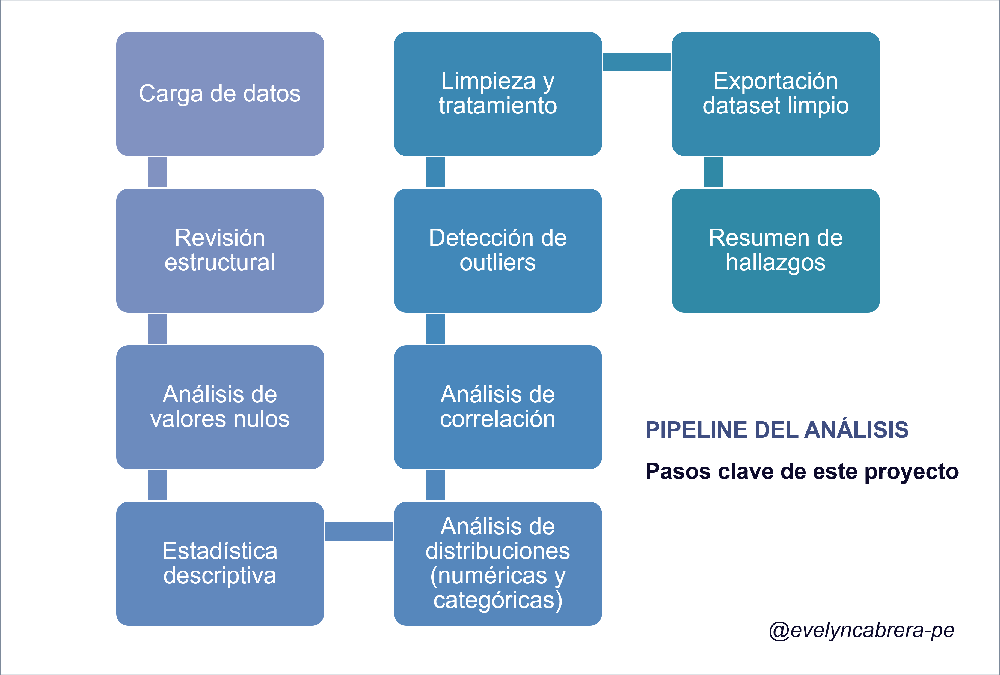

# 01 · EDA Pipeline — Delinquency Prediction Dataset


---

## Descripción / Overview

Este proyecto presenta un análisis exploratorio de datos (EDA) aplicado a un dataset bancario de predicción de morosidad. El objetivo es diagnosticar la calidad de los datos, identificar patrones de riesgo tempranos y dejar el dataset limpio y documentado para su uso en modelos predictivos.

> **Propósito del pipeline:** entender la data antes de modelarla. Un buen EDA es la diferencia entre un modelo que funciona y uno que miente.

---

## Dataset

| Atributo | Detalle |
|---|---|
| Archivo | `data_set_delinquency_prediction.xlsx` |
| Registros | 500 clientes |
| Variables | 20 columnas |
| Variable objetivo | `Delinquent_Account` (binaria: 0 / 1) |

### Variables principales

**Numéricas:** `Age`, `Income`, `Credit_Score`, `Credit_Utilization`, `Missed_Payments`, `Loan_Balance`, `Debt_to_Income_Ratio`, `Account_Tenure`

**Categóricas:** `Employment_Status`, `Credit_Card_Type`, `Location`, `Month_1` a `Month_6` (historial de pagos)

**Identificador:** `Customer_ID`

---

## Pipeline del análisis


---

## Hallazgos principales

### Calidad de datos
- Sin registros duplicados detectados
- Variables con datos faltantes: `Income` (~8%), `Loan_Balance` (~6%), `Credit_Score` (<1%)
- `Month_1` a `Month_6` almacenadas como texto en lugar de categorías ordinales → inconsistencia a corregir
- Distribución sesgada en `Loan_Balance` y ratios de deuda

### Tratamiento de nulos

| Variable | Estrategia aplicada |
|---|---|
| `Income` | Imputación por mediana · variables indicadoras creadas |
| `Loan_Balance` | Imputación segmentada por grupo de ingreso |
| `Credit_Score` | Imputación por mediana (baja tasa de nulos) |

### Indicadores de riesgo identificados
- Pagos perdidos frecuentes o recientes (`Missed_Payments`)
- Alta utilización de crédito (cercana al 100%)
- Alto ratio deuda/ingreso (`Debt_to_Income_Ratio`)
- Credit score bajo
- Historial de comportamiento de pago (`Month_1`–`Month_6`) como señal fuerte no lineal

### Correlaciones
- Las variables numéricas muestran correlaciones lineales débiles con la variable objetivo
- Las **relaciones no lineales y el historial de pagos** son los predictores más relevantes
- La variable `Location` tiene alta cardinalidad → puede introducir ruido en el modelo

---

## Estructura del repositorio

```
eda-pipeline/
│
├── data/
│   ├── raw/
│   │   └── data_set_delinquency_prediction.xlsx
│   └── clean/
│       └── delinquency_clean.csv
│
├── notebooks/
│   └── eda_pipeline.ipynb
│
├── outputs/
│   ├── 01_missing_values_heatmap.png
│   ├── 02_numeric_distributions.png
│   ├── 03_boxplots_by_target.png
│   ├── 04_categorical_vs_target.png
│   ├── 05_payment_history.png
│   ├── 06_payment_heatmap.png
│   └── 07_correlation.png
│
├── requirements.txt
└── README.md
```

---

## Cómo ejecutar / How to run

```bash
# 1. Clonar el repositorio
git clone https://github.com/evelyncabrera-pe/eda-pipeline.git
cd eda-pipeline

# 2. Instalar dependencias
pip install -r requirements.txt

# 3. Abrir el notebook
jupyter notebook notebooks/eda_pipeline.ipynb
```

### Dependencias (`requirements.txt`)

```
pandas>=2.0
matplotlib>=3.7
seaborn>=0.12
openpyxl>=3.1
jupyter>=1.0
```
---

## Próximos pasos / Next steps

- [ ] Estandarizar y codificar variables categóricas (`Month_1`–`Month_6`)
- [ ] Feature engineering sobre el historial mensual de pagos
- [ ] Aplicar estrategias de encoding para variables de alta cardinalidad
- [ ] Usar modelos no lineales (árbol de decisión, Random Forest) para capturar relaciones complejas

---

## Sobre este proyecto / About

Este repositorio forma parte del portafolio de datos de **Evelyn Cabrera Arias**, Data Analytics Translator Senior con más de 10 años de experiencia en banca, riesgo crediticio y cobranza.

🔗 [linkedin.com/in/evelyn-cabrera](https://linkedin.com/in/evelyn-cabrera) · [github.com/evelyncabrera-pe](https://github.com/evelyncabrera-pe)
